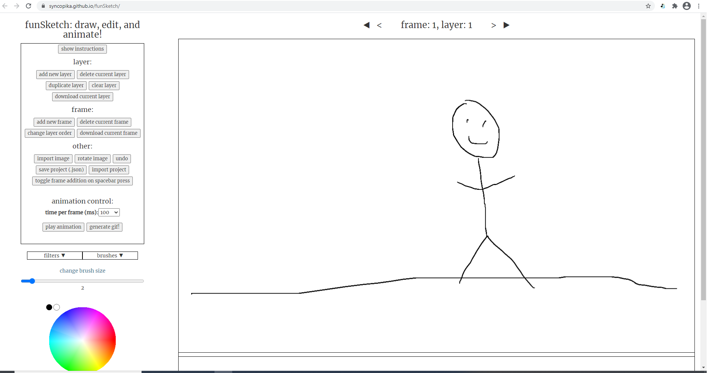
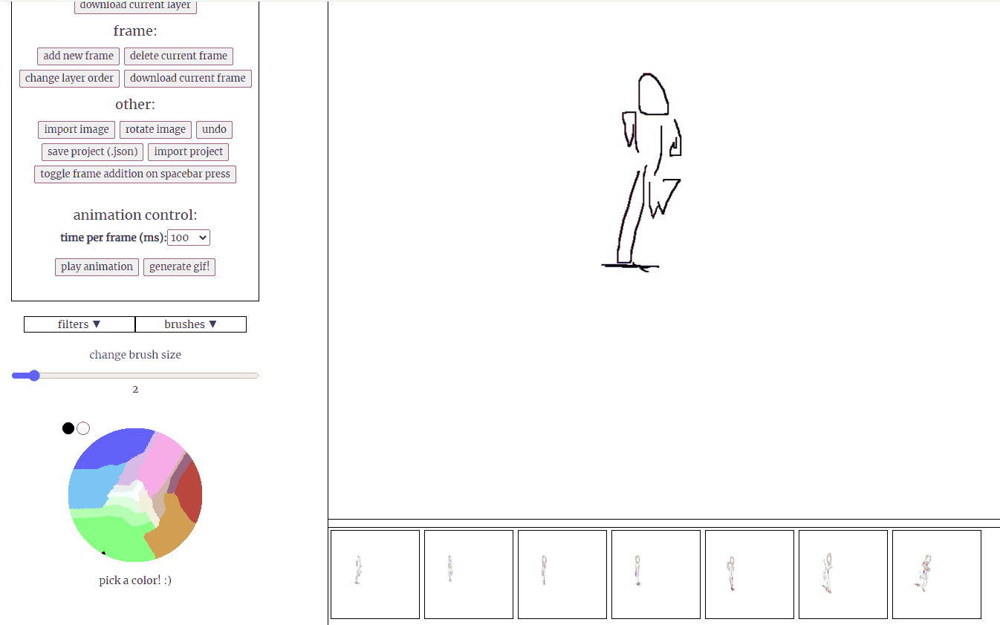

# funSketch    
an experimental application that has simple drawing features, as well as some interesting filter and brush options.    
but more importantly, you can also make some quick, simple animations!    
    
current look:    
    
    
animation demo:    
    
    
try it here: https://syncopika.github.io/funSketch/    
also, I tried out the floodfill feature using web workers <a href='https://syncopika.github.io/funSketch/floodfillExperiment/floodfillExperiment.html'>here</a>! It looks like they definitely help speed up performance.     
    
### problems to fix / things to do:        
- when rotating, the coordinates where the paintbrush strikes when mousedown get changed.        
    
- adjustable canvas    
    
### acknowledgements:    
thanks to Johan Nordberg's gif.js library (https://jnordberg.github.io/gif.js/), which I use to generate the output for an animation.    
also thanks to mr.doob's harmony project for some brush ideas (https://github.com/mrdoob/harmony).    
    
note: not meant to be supported on mobile devices.    
