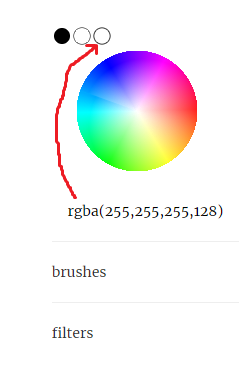

# funSketch    
An application made with React that has simple drawing features, as well as some interesting filter and brush options.    
    
but more importantly, you can also make some quick, simple animations!    
    
try it here: https://syncopika.github.io/funSketch/    
    
current look:    
    
    
animation demo:    
    
    
### notes:    
You'll notice with the color wheel there are 2 white color options.    
    
    
The one to the right has an alpha value of 128 whereas the other has an alpha value of 255.    
Because of the way I have things set up, the white with alpha as 128 can be used to create an opaque white color when the layers are merged to create a final frame.    
    
Otherwise, any white color with 255 as the alpha value is treated as transparent (so those pixels are ignored when merging layers). By default, every canvas is filled with `rgba(255,255,255,255)`.    
    
### installation:    
You'll need node.js and npm. `cd` into this repo and run `npm install` to install all the dependencies. Then run `npm run serve` to serve the application (with hot reload!). To run the tests, run `npm test`.    
    
Alternatively, you can run `npm run dev` to build a development bundle in the `/dist` directory and then `node server.js`.    
    
### acknowledgements:    
thanks to William Malone's <a href='http://www.williammalone.com/articles/create-html5-canvas-javascript-drawing-app/'>fantastic tutorial</a>, which much of this work is based on.    
    
thanks to Johan Nordberg's <a href='https://jnordberg.github.io/gif.js/'>gif.js library</a>, which I use to generate the output for an animation.    
    
thanks to mr.doob's <a href='https://github.com/mrdoob/harmony'>harmony project</a> for some brush ideas.    
    
and much thanks to the many authors of various blogs, StackOverflow posts and other sources of related information I referred to, which helped save me a ton of time :).    
    
