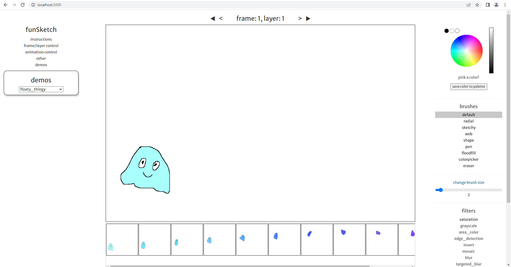
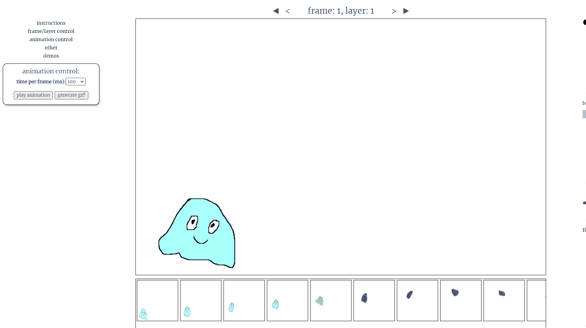

# funSketch    
An experimental application made with React that has simple drawing features, as well as some interesting filter and brush options.    
    
but more importantly, you can also make some quick, simple animations!    
    
try it here: https://syncopika.github.io/funSketch/    
    
current look:    
    
    
animation demo:    
    
    
    
### installation:    
You'll need node.js and npm. `cd` into this repo and run `npm install` to install all the dependencies. Then run `node server.js` to serve the application. To run the tests, run `npm test`.    
    
### acknowledgements:    
thanks to William Malone's <a href='http://www.williammalone.com/articles/create-html5-canvas-javascript-drawing-app/'>fantastic tutorial</a>, which much of this work is based on.    
    
thanks to Johan Nordberg's <a href='https://jnordberg.github.io/gif.js/'>gif.js library</a>, which I use to generate the output for an animation.    
    
thanks to mr.doob's <a href='https://github.com/mrdoob/harmony'>harmony project</a> for some brush ideas.    
    
and much thanks to the many authors of various blogs, StackOverflow posts and other sources of related information I referred to, which helped save me a ton of time :).    
    
please note: this application is not meant to be supported on mobile devices.    
